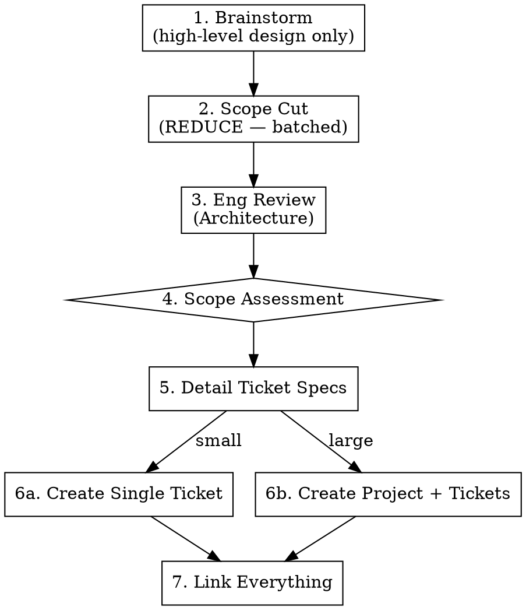

# Creating Linear Tickets

## Overview

Turn ideas into well-scoped Linear tickets through structured review. Orchestrates: brainstorm → scope cut (REDUCE) → Eng review (architecture) → scope assessment → Linear creation.

Every ticket created by this skill carries clear acceptance criteria, a Verification block, and an Implementation Snapshot — so a downstream "start the ticket" workflow can execute without re-discovering context. Full-workflow tickets additionally get a scope cut + architecture review; Fast Path tickets skip those by design. There is no separate design document — context lives in the project/ticket descriptions.

**Announce at start:** "Using creating-linear-tickets to turn this idea into actionable tickets."

> **Linear team:** The target Linear team name comes from the project's `.claude/CLAUDE.md`. Always confirm the target team with the user (or via `mcp__linear-server__list_teams`) before creating any issues.
>
> **Linear MCP tools:** hosted server, **upsert** tools (`save_*` — no separate create/update). Full tool surface + `save_issue` param reference: read `linear-mcp-reference.md` in this skill's directory — one home per fact, don't re-inline it here.
>
> **Status on create:** set only `Backlog`/`Todo` here, and `In Progress` is set manually when work starts. Do NOT manually flip `In Review`/`Done` — the native GitHub integration owns those transitions where configured (PR opened → In Review is a per-team setting; Linear's default maps opened → In Progress; merged → Done is the default). Manually setting them fights the webhook — `starting-linear-ticket` Step 12 verifies and falls back.

## Required Input

An idea, feature request, bug report, or initiative. Can be:
- A verbal description ("I want to add Google Calendar integration")
- A doc reference (Notion, Confluence, etc.)
- A Linear project/milestone to break down
- A bug report or user feedback

## Fast Path — Small, Well-Scoped Tickets

**For solo work, the Fast Path is the DEFAULT — run the full workflow only when a full-workflow signal fires** (multiple viable approaches, 3+ code areas touched, a genuinely new concept). Skip brainstorming and reviews when ALL of these are true:

- The problem is obvious and well-understood (e.g., a specific bug with a known fix)
- The scope is already tight — one change, one area of the codebase
- There's no design ambiguity — no "should we do A or B?" questions
- The user has clearly articulated what they want

**Fast path:** Read the relevant code to understand the current state → create a well-formed ticket with problem statement, affected code, solution sketch, and acceptance criteria. No brainstorming, no scope-cut round, no Eng review.

**Examples of fast-path tickets:**
- "Day boundary uses UTC instead of local time" — it's a bug, the fix is clear
- "Add loading spinner to the save button" — tiny UI improvement, no ambiguity
- "Rename `foo` to `bar` across the codebase" — mechanical refactor

**Examples that need the full workflow:**
- "Add Google Calendar integration" — multiple approaches, scope unclear
- "Redesign the onboarding flow" — requires exploring alternatives
- "Add a weekly review feature" — new concept, needs the full workflow (scope cut + Eng review)

**When in doubt, ask:** "This seems well-scoped enough for a quick ticket. Want me to run the full workflow or just create the ticket?"

## Workflow (Full)

**IMPORTANT: Reviews happen early, before detailed ticket design.** The flow is: high-level design → reviews (challenge scope/architecture) → detailed ticket specs. Do NOT write detailed ticket descriptions, acceptance criteria, or scope before the reviews have run. The reviews exist to shape what the tickets should be.



### Step 1: Brainstorm (High-Level Design)

**REQUIRED SUB-SKILL:** Invoke `superpowers:brainstorming`

Provide the idea as context. Brainstorming should produce a **high-level design** — the shape of the work, major components, key decisions, and a rough ticket breakdown (names + one-line descriptions). Do NOT write detailed ticket specs (full acceptance criteria, detailed scope, etc.) at this stage — that comes after reviews.

Output should be:
- Key design decisions and trade-offs explored
- Rough dependency graph
- Ticket names + one-line summaries (not full specs)

**Do NOT save a design doc yet** — the design will be refined by the review phases.

### Step 2: Scope Cut (REDUCE)

*(Folded in from the archived `plan-review-ceo` skill 2026-07-07 — solo, only its REDUCE phase earned its keep. If the team ever grows past one person, resurrect the full EXPAND → HOLD → REDUCE arc from `~/.claude/skills/plan-review-ceo/SKILL.md.archived` — shared-vision building is where EXPAND/HOLD pay off.)*

Run a ruthless scope cut on the brainstorming output. **Batch all of it into ONE message** with a recommended answer per item ("all recommendations fine" must be a valid one-word reply):

1. **Smallest version that validates the idea** — what must be in v1? Can we get 80% of the value with 50% of the work?
2. **Explicitly NOT building** — for each item, argue for cutting it; record WHY and what would trigger building it later.
3. **Kill test per surviving item** — if we cut it and users complain, add it back; if nobody notices, it was scope creep.

**Output (unchanged contract for the steps below):**
- **Building now** — what goes into tickets
- **Building later** — deferred with rationale
- **Not building** — explicitly killed

This may remove or reshape tickets from the brainstorming output.

### Step 3: Eng Review (Architecture)

**REQUIRED SUB-SKILL:** Invoke `plan-review-eng` in **planning mode**

Pass the validated scope from the Step 2 scope cut. The Eng review produces:
- ASCII architecture diagram
- File list (create/modify)
- Failure modes
- Dependency graph for ticket ordering
- "What already exists" section

### Step 4: Scope Assessment

Auto-detect whether this is a single ticket or project with multiple tickets:

| Signal | Single ticket | Project + tickets |
|--------|--------------|-------------------|
| Architecture touches | 1-2 areas | 3+ distinct areas |
| "Building now" items | 1-3 related | 4+ or separable |
| Natural ticket count | 1 | 2+ vertical slices |
| Has "Building later" list | No or trivial | Yes, meaningful |

**Always ask to confirm** before creating: "This looks like [single ticket / a project with N tickets]. Sound right?"

### Step 5: Detail Ticket Specs

**Only now — after reviews have validated scope and architecture — write detailed ticket descriptions.** For each ticket, flesh out:
- Full scope (what's included, what's not)
- Acceptance criteria (specific, testable)
- Dependencies on other tickets
- **Verification** — observable signals, test scenarios, post-merge commands (see template below)
- **Implementation Snapshot** — produced by scout subagent in 5a
- **Sharp Edges** — pulled from project memory in 5b
- Architecture notes from Eng review

Present each ticket to the user for validation before creating in Linear.

#### Step 5a: Scout subagent — produce Implementation Snapshot

For each ticket, spawn a scout subagent (Agent tool, `subagent_type: "general-purpose"`) using the brief in `scout-prompt.md`. The scout returns a markdown block containing:
- Files to modify / create
- Patterns to follow (with `<symbol>` in `<path>` references)
- Schema or types touched
- Current commit SHA at scout time

Paste this verbatim into the ticket's Implementation Snapshot section. The scout writes no code and proposes no changes — it only anchors the ticket in the current codebase.

This step is what makes a freshly created ticket immediately runnable: the implementing agent picks up real file paths and conventions, not generic guidance.

#### Step 5b: Sharp Edges — pull from project memory

Grep the project's memory and conventions for entries whose subject intersects this ticket's scope:

- Check the project's `.claude/CLAUDE.md` and any `~/.claude/projects/<this-project-encoded-cwd>/memory/*.md` for "Sharp Edges" / feedback notes; skip if none exist.

```bash
# Adapt keywords to the ticket; skip if no memory dir exists.
grep -l -E '<keywords from ticket>' ~/.claude/projects/<this-project-encoded-cwd>/memory/*.md 2>/dev/null
```

Map keywords from the ticket scope (e.g. "migration", "bulk write", "UI copy", "pagination", "asset swap") to whatever Sharp Edges the project has recorded. Inline only the rules that are actually relevant. Do not dump everything — noise erodes signal.

### Step 6a: Create Single Ticket

```
mcp__linear-server__save_issue with:
- title: Descriptive, action-oriented
- description: See ticket template below
- team: <team name or id>  # Look up with list_teams; team name comes from project .claude/CLAUDE.md — confirm first
- state: <backlog state name/type/id>  # Look up with list_issue_statuses
- priority: 1-4 based on discussion  # 1=Urgent, 2=High, 3=Medium, 4=Low
- labels: [Feature | Bug | Improvement]  # label names or ids; look up with list_issue_labels
```

(Omitting `id` creates the issue; to update it later, call `save_issue` again with the returned `id`.)

### Step 6b: Create Project + Tickets

1. **Create or find project** — Use existing milestone if applicable, otherwise create via `mcp__linear-server__save_project`
   - Put project-level context (architecture, scope decisions, success criteria, failure modes) in the **project description** — this is the design doc, not a separate document
2. **Create vertical-slice tickets** — Each delivers complete user value:
   - Include frontend + backend + tests in a single ticket
   - Order by dependency graph from Eng review
   - Each ticket is self-contained: all requirements, scope, and acceptance criteria are in the ticket description itself
   - This flat vertical-slice layout is the **DEFAULT**. Only branch into sub-issues (see Step 6b-ii) when a slice is large enough to need a tracked subtree.
3. **Create "Building later" tickets** — Separate backlog tickets with rationale preserved from the scope cut
4. **Set machine-readable dependency relations** (see Step 6b-i below) — do NOT rely on free-text only.

### Step 6b-i: Encode dependencies as real relations

When this skill produces multiple related tickets, the dependency graph from the Eng review MUST be set as **machine-readable relations** on `save_issue`, not just described in prose. A downstream runner reads these edges via `get_issue` to order work; free text is invisible to it.

- **`blockedBy` / `blocks`** — hard ordering. If TICKET-B cannot start until TICKET-A merges, set `blockedBy: ["TICKET-A"]` on B (or equivalently `blocks: ["TICKET-B"]` on A).
- **`relatedTo`** — soft links between tickets that touch the same area but have no ordering constraint.
- All three are **append-only** arrays of issue ids/identifiers; use `removeBlockedBy` / `removeBlocks` / `removeRelatedTo` to undo.
- **Still keep a short human-readable `Dependencies` note** in the description (e.g. "Depends on: PROJ-12") for humans skimming the ticket — but the relations are the source of truth for runners.

Because relations reference issue identifiers, create the tickets first (or capture the returned identifiers), then set relations. Example — mark a ticket as blocked by an already-created one:

```
mcp__linear-server__save_issue with:
- id: PROJ-18                 # the ticket being updated (created in a prior call)
- blockedBy: ["PROJ-12"]      # PROJ-18 cannot start until PROJ-12 is done
- relatedTo: ["PROJ-15"]      # soft link: same subsystem, no ordering
```

The runner later calls `get_issue` on PROJ-18 and sees the `blockedBy`/`relatedTo` edges directly.

### Step 6b-ii (OPTIONAL): Sub-issues for a large slice

**Default to flat vertical slices.** Only use this path when a single vertical slice is large enough that it warrants a tracked subtree of its own (e.g. it has several independently-verifiable pieces that each deserve their own acceptance criteria and status). When warranted:

1. Create a **parent "epic" issue** via `save_issue` (carrying the slice-level Problem / Scope / shared acceptance criteria). Capture its identifier.
2. Create each **child issue** via `save_issue` with `parentId: <epic identifier>`. Children **inherit team/project** from the parent, so you do not re-specify them.
3. Children can still carry their own `blockedBy`/`blocks`/`relatedTo` relations among themselves.

Example — epic plus one child:

```
# 1. Parent epic (create)
mcp__linear-server__save_issue with:
- title: "Calendar sync (epic)"
- team: <team name or id>
- project: <project name or id>
- description: <slice-level Problem / Scope / shared acceptance criteria>
# → returns identifier, e.g. PROJ-30

# 2. Child issue (inherits team + project from parent)
mcp__linear-server__save_issue with:
- parentId: PROJ-30
- title: "OAuth token exchange + refresh"
- description: <child-scoped ticket using the template below>
```

To list a parent's children later, use `list_issues` with `parentId: PROJ-30`.

### Step 7: Link Everything

- If project was created, ensure all tickets are linked to it
- Report back: list of created tickets with IDs and titles

**No separate design document.** Project-level design context goes in the project description. Ticket-level requirements go in the ticket description. This avoids information being split across multiple places.

## Ticket Description Template

```markdown
## Problem
<Problem statement — why are we building this?>

## Scope
<What's included, what's not. Specific enough for an implementer to work without asking questions.>

## Acceptance Criteria
- [ ] <Specific, testable condition>
- [ ] <Each criterion maps to a verifiable outcome>
- [ ] <Include both happy path and key edge cases>

## Verification

### Observable Signals
Declarative "what's true after this ships":
- <e.g., `GET /resource/<slug>` returns HTML containing `[data-testid="resource-summary"]` matching the stored record>
- <e.g., a summary row exists for every entity after backfill>
- <e.g., error tracker shows zero new errors in the changed module for 1 hour post-deploy>

### Test Scenarios (TDD inputs)
Explicit cases the implementer must write — each becomes a failing test first:
- <e.g., looks up entity by slug, returns matching record>
- <e.g., missing slug returns 404>
- <e.g., malformed slug normalized to lowercase>

### Post-Merge Verification
Runnable commands the agent executes during canary. Use framework-agnostic checks; pull the actual commands from the project's `.claude/CLAUDE.md` (Verification Commands section):
- File-exists / symbol checks: `test -f <path>`, `rg '<symbol>' <path>`
- Behavior check: `curl -s <url> | grep -q 'data-testid="resource-summary"'`
- Data integrity check: run the project's data-verification command (example: if the project uses Supabase, query `information_schema` / `SELECT count(*)`; adapt to the project's stack)

## Implementation Snapshot
*As of `<SHA>` on `<YYYY-MM-DD>`. Treat as hint — agent re-verifies on pickup.*
- **Files to modify:** <paths>
- **Files to create:** <paths>
- **Patterns to follow:** see `<symbol>` in `<path>` for <what>
- **Schema/types touched:** <tables / columns / types> (or "None")

## Sharp Edges (Durable)
Project-specific traps relevant to this change (pull from project `.claude/CLAUDE.md` / memory; skip if none):
- <e.g., a schema-cache reload step required after DDL — adapt to the project's stack>
- <e.g., a row-cap that forces pagination on bulk queries>
- <e.g., a branding/copy normalization rule for user-facing text>

## Dependencies
<Human-readable note, e.g. "Depends on: PROJ-XX", or "None". The authoritative dependency edges are the `blockedBy`/`blocks`/`relatedTo` relations set on the issue via `save_issue` — keep this note in sync with them.>

## Not In Scope
<Items explicitly deferred or cut>
```

**Why these sections matter for autonomous execution:**

- **Acceptance Criteria** = the contract.
- **Verification → Observable Signals** = the operational layer that makes the contract executable. Prevents "tests pass but behavior is wrong" bugs (slug-vs-UUID class).
- **Verification → Test Scenarios** = TDD inputs the implementer literally writes as failing tests first.
- **Verification → Post-Merge Verification** = canary commands the agent runs after deploy.
- **Implementation Snapshot** = codebase anchors so the agent doesn't reinvent helpers or pick wrong file paths. Snapshot is a hint — agent re-verifies on pickup before trusting it.
- **Sharp Edges** = curated subset of accumulated tribal knowledge, scoped to this change.

**No separate design document.** Project-level context (architecture, data flow, scope decisions, failure modes, success criteria) lives in the project description. Each ticket is self-contained with its own requirements.

## Git Guardrail

When this skill (or a downstream "start the ticket" workflow) touches code:

- **Never commit directly to `main`/`master`.** Use a worktree + branch (`superpowers:using-git-worktrees`).
- **Always open a PR** — never merge without **explicit user approval**.
- Run `superpowers:verification-before-completion` before declaring work done, and the `superpowers:requesting-code-review` skill (it dispatches its own reviewer subagent) before merge.

## Multi-Agent Coordination

For running a project's tickets in parallel, hand off to the **`linear-todo-runner`** skill — it owns the dependency graph, rolling agents, and crash-safe resume from Linear states + claim comments. Don't reimplement that orchestration here.

## Common Mistakes

### Creating tickets without acceptance criteria
- **Problem:** Executor doesn't know what "done" looks like
- **Fix:** Every ticket gets specific, testable acceptance criteria derived from the review phases

### Horizontal instead of vertical ticket slicing
- **Problem:** "Create API route", "Create component", "Create hook" — none deliver value alone
- **Fix:** Each ticket is a vertical slice: backend + frontend + tests = usable feature

### Skipping reviews when a full-workflow signal is present
- **Problem:** Assumptions go unchallenged, scope creeps during implementation
- **Fix:** Run the full workflow when the work has multiple viable approaches, touches 3+ code areas, or introduces a new concept. This does NOT override the Fast Path — a ticket meeting ALL Fast Path criteria skips reviews by design.

### Not preserving rationale for deferred items
- **Problem:** "Building later" items lose context, become meaningless backlog entries
- **Fix:** Include WHY it was deferred and WHAT would trigger building it

## Red Flags
- "The acceptance criteria are obvious" (write them anyway — Fast Path tickets still get full acceptance criteria)
- "Let me just create the tickets and start coding"
- "We can figure out the architecture during implementation"
- "It's basically one change" — when it actually has multiple viable approaches or touches 3+ areas (that's a full-workflow signal, not a Fast Path ticket)

**All of these mean: Run the workflow — unless ALL Fast Path criteria are genuinely met, in which case the Fast Path IS the workflow.**
