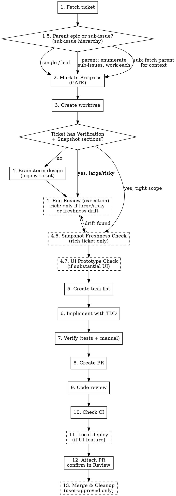

# Starting Work on a Linear Ticket

## Overview

Complete end-to-end workflow for Linear tickets: fetch → in progress → worktree → design pass (brainstorm only for legacy tickets) → (UI prototype) → task list → TDD → verify → PR → code review → CI → in review → (user-approved) merge & cleanup.

**Announce at start:** "I'm using the starting-linear-ticket skill to set up for this ticket."

> **Linear MCP note:** hosted server, **upsert** tools (`save_*` — no `create_issue`/`update_issue`). Full tool surface, param gotchas, and the never-hardcode-the-team rule: read `~/.claude/skills/creating-linear-tickets/linear-mcp-reference.md` — one home per fact, don't re-inline it here.

## Required Input

User provides ticket identifier (e.g., "PROJ-63", "start PROJ-63", or just the number if context is clear).

## Multiple Tickets / Cross-Repo Work → linear-todo-runner

This skill runs **one ticket**. For 2+ independent tickets, cross-repo tickets, or working through a queue with parallel agents, hand off to **`linear-todo-runner`** — it owns orchestration (dependency DAG, agent lifecycle, crash-safe resume from Linear states + claim comments). Don't reimplement that coordination here; two orchestration specs drift apart.

## Workflow



### Step 1: Fetch Ticket from Linear

```
mcp__linear-server__get_issue with id: "<ticket-id>", includeRelations: true
```

Extract and summarize:
- **Title**
- **Description** (requirements, acceptance criteria)
- **Labels** (Bug, Feature, Improvement)
- **Priority**
- **Any linked issues or dependencies**

`get_issue` returns the issue plus, **when called with `includeRelations: true`**, its dependency edges (`blockedBy`/`blocks`/`relatedTo`) — omit the flag and the response carries no relations. It does **not** return parent/children in the payload; detect a parent's sub-issues in Step 1.5 with `list_issues {parentId}`. Note those relations now — they drive Step 1.5.

**Read the surrounding context before planning.** Also pull the issue's **comments** (`mcp__linear-server__list_comments`) and the **project overview** (`mcp__linear-server__get_project` via the issue's `projectId`): comments carry prior-session decisions/blockers, and the project description carries the cross-cutting spec the ticket assumes. Skip whichever doesn't exist.

If ticket not found or MCP timeout: ask user to verify ticket ID or run `/mcp`.

**Check for acceptance criteria.** If the ticket does NOT have clear acceptance criteria (specific, testable conditions that define "done"), STOP and ask the user to provide them before proceeding. Do not invent acceptance criteria or proceed without them — they drive the design, tests, and verification steps downstream.

### Step 1.5: Resolve the Sub-Issue Hierarchy

The fetched issue is one of three shapes. Branch before doing any work:

**A — Parent epic (has children / sub-issues).** Don't implement the epic directly. Enumerate its sub-issues and work them as the real units of work:

```
mcp__linear-server__list_issues with:
- parentId: "<this-issue-id>"
```

For each sub-issue, run the full per-ticket workflow (status gate → worktree → design → TDD → PR → In Review). You may parallelize independent sub-issues via `linear-todo-runner` (see "Multiple Tickets / Cross-Repo Work" above). **Roll status up to the parent:** move the parent to `In Progress` when the first sub-issue starts, and only suggest moving the parent to `Done` once every sub-issue is `Done`. Each sub-issue still goes through its own status gates independently.

**B — Sub-issue (has a parent).** Fetch the parent for context before designing — the parent epic usually carries the cross-cutting acceptance criteria, shared schema, and "why" that the leaf ticket assumes:

```
mcp__linear-server__get_issue with id: "<parent-id>"
```

Use the parent's description/criteria to inform the design pass, then work this sub-issue normally. After it merges, the parent's roll-up rule (above) decides whether the parent advances.

**C — Standalone issue (no parent, no children).** Proceed straight to Step 2.

### Step 2: Mark as In Progress — VERIFICATION GATE

> **This is a non-skippable gate, not a nicety.** Tie it to `superpowers:verification-before-completion`: the Linear status must reflect reality at every transition, and that fact must be verified (re-read the issue after writing), never assumed. Do not let context pressure ("I'll update Linear later") skip it. No design or implementation begins until the issue is verified `In Progress`.

```
mcp__linear-server__save_issue with:
- id: "<ticket-id>"
- state: "In Progress"
```

(Confirm the exact status name with `mcp__linear-server__list_issue_statuses` for the team if "In Progress" isn't present.) Preserve existing labels (Bug/Feature/Improvement). For a parent epic, also advance the parent per the Step 1.5 roll-up rule. **Verify:** re-read with `get_issue` (or the save response) and confirm the state actually changed before moving on.

### Step 3: Create Git Worktree

**REQUIRED:** Invoke `superpowers:using-git-worktrees` skill.

**Git guardrail (strict):** Never commit directly to `main`/the default branch. Never merge a PR without explicit user approval. All work happens in a worktree on a feature branch; merging is a separate, user-gated step (Step 13).

Use branch name from Linear if available (`gitBranchName` field), otherwise generate:
- Feature: `feature/<prefix>-<number>-<slug>`
- Bug: `fix/<prefix>-<number>-<slug>`
- Improvement: `improve/<prefix>-<number>-<slug>`

Where `<slug>` is kebab-case from ticket title.

### Step 4: Design Pass (Conditional Brainstorm + Eng Review)

**Inspect the ticket for new-template sections:**

- `## Verification` (with Observable Signals + Test Scenarios + Post-Merge Verification)
- `## Implementation Snapshot` (with `As of <SHA>` marker)

**Path A — Ticket has both sections (rich ticket from `creating-linear-tickets`):**
- **Skip `superpowers:brainstorming`.** The ticket already encodes intent, observable signals, and codebase anchors. Asking clarifying questions defeats the autonomy goal.
- **Eng review is conditional here — the rich ticket already passed an eng review at creation time.** Run `plan-review-eng` in **execution mode** only when the expected diff is large/risky (3+ files, a schema/API contract change, or a security-sensitive path). Otherwise proceed straight to Step 4.5; **if the freshness check there surfaces drift, come back and run `plan-review-eng` before continuing** — a stale snapshot means the creation-time review no longer covers reality. TDD + code review + CI remain the quality gates either way.
- If an eng review runs and surfaces a real ambiguity (not just suggestions), STOP and escalate to the user. Otherwise proceed to Step 4.5.

**Path B — Ticket is missing Verification or Implementation Snapshot (legacy / hand-written):**
- **REQUIRED:** Invoke `superpowers:brainstorming` skill (current behavior).
  - Ask clarifying questions one at a time
  - Propose 2-3 approaches with trade-offs
  - Present design incrementally for validation
  - Write design doc to `docs/plans/YYYY-MM-DD-<topic>-design.md`
- Then invoke `plan-review-eng` in **execution mode**.

**Both paths produce:** edge cases to handle, codepath diagram with test coverage mapping, perf concerns, and an updated test plan matching the acceptance criteria. The test plan feeds Step 6 (TDD implementation).

**Before designing, check for Sharp Edges:** Read the project's `.claude/CLAUDE.md` and any `~/.claude/projects/<this-project-encoded-cwd>/memory/*.md` files for "Sharp Edges" or known-gotcha notes relevant to this area of the codebase; skip if none exist.

### Step 4.5: Snapshot Freshness Check (Path A only)

The Implementation Snapshot in the ticket was captured at ticket-creation time. Before trusting it, run the lightweight probes in `freshness-check.md`:

- Each path under "Files to modify" / "Files to create" exists (or is correctly marked as new).
- Each "see `<symbol>` in `<path>`" reference still resolves (grep for the symbol at that path).
- Each schema/data-model anchor still exists. Use a framework-agnostic probe: file-exists check or symbol grep against the schema definition, and the ticket's own **Post-Merge Verification** commands. (Example: if the project uses Supabase, query `information_schema.columns`; adapt to the project's stack.)

**If all probes pass:** trust the snapshot. Proceed.

**If any probe fails:** spawn a Rescue Scout subagent (`Task` tool, `subagent_type: "general-purpose"`, brief from `~/.claude/skills/creating-linear-tickets/scout-prompt.md` "Rescue Scout" mode if that skill exists; otherwise instruct the subagent to refresh only the broken anchors). It refreshes only the broken anchors and writes the refreshed snapshot to `<worktree>/SNAPSHOT.md`. The Linear ticket is NOT updated — the durable spec hasn't changed.

After rescue, the implementing agent uses the refreshed snapshot for the rest of the workflow.

### Step 4.7: UI Prototype Check (conditional — visually substantial UI only)

**When:** The ticket introduces or significantly reworks user-facing UI — a new page, a redesigned surface, new card/list layouts, a non-trivial component. **Skip when:** backend/pipeline-only work, type-only changes, copy tweaks, or small CSS adjustments — the cost isn't worth it there.

**Why:** A 5-minute throwaway prototype catches "this isn't the layout I pictured" *before* you've written components, tests, and an approval flow against the wrong design. Wrong-look corrections after the build are the expensive ones.

**How:**
1. Build a single self-contained throwaway artifact (one HTML file with inline CSS/JS is usually enough; or a quick component/page stub) that renders the proposed layout. **Use real data where you can** — query the actual DB / API so the look is faithful to production content, not lorem-ipsum. Keep it disposable; this is not production code and gets no tests.
2. Render it and capture screenshots at **both** the project's desktop and mobile breakpoints (e.g. 1280×800 + 375×812). Drive a real browser (claude-in-chrome MCP or a local static server) — don't reason about the look from the source.
3. Present the screenshots to the user and **get explicit sign-off on the look** (layout, hierarchy, lanes, wording) before proceeding. Fold any requested changes into the prototype and re-confirm.
4. Only then continue to the task list. The signed-off prototype becomes the visual reference for implementation — but the production build still follows TDD and the project's UI e2e rules (e.g. `boundingBox()` checks); the prototype does not replace those.

Delegate the prototype build to a subagent when the data is large or the artifact is involved (keeps the dataset out of the lead's context). The lead drives the browser screenshots and the user sign-off.

### Step 5: Create Task List

**REQUIRED:** Before writing any code, create a `TaskCreate` todo list that breaks the design into implementation tasks.

Based on the design pass output (the ticket's own sections for rich tickets, the brainstorm doc for legacy ones), create tasks for:
- Each piece of functionality to implement (API endpoints, components, pages, etc.)
- A verification task (run the project's full Verification Commands)
- A PR creation task

Set up dependencies with `TaskUpdate` (e.g., verification blocked by implementation tasks, PR blocked by verification).

Update task status as you work: `in_progress` when starting, `completed` when done. This gives the user visibility into progress.

### Step 6: Implement (subagents when parallelism pays, inline otherwise)

**Dispatch subagents when the task list has 3+ genuinely independent tasks** — that's when parallel dispatch beats doing it yourself. **For small or sequential tickets (most solo tickets), implement inline in this session with TDD** — a subagent per 1-2-line task is pure overhead.

When dispatching, send implementation tasks to subagents:

1. **Identify independent tasks** — tasks that don't depend on each other can run in parallel
2. **Dispatch each task** using `Task` tool with `subagent_type: "general-purpose"`
3. **Include full context** in each subagent prompt:
   - The worktree path (so they edit the right files)
   - Which files to modify and what changes to make
   - The acceptance criteria for that task
   - Instructions to follow TDD (RED → GREEN → REFACTOR)
4. **Run independent tasks in parallel** — launch multiple Task calls in a single message
5. **Run dependent tasks sequentially** — wait for blockers to complete first
6. **Update task status** — mark tasks `completed` as subagents finish

**Subagent prompt template:**
```
You are working in the worktree at: <worktree-path>

Task: <task description>

Files to modify:
- <file path> — <what to change>

Acceptance criteria:
- <criterion 1>
- <criterion 2>

## How to Work

1. Read the project's `.claude/CLAUDE.md` — it has a "Verification Commands"
   section with the exact commands you must run. These mirror CI. Do NOT assume
   a package manager, framework, or specific dev/build/test/lint command — use
   what the project defines.
2. Follow TDD:
   a. Write failing test first
   b. Implement minimal code to pass
   c. Refactor if needed
3. **Side-quests — out-of-scope findings go to Linear, not into this PR.** If you
   spot an unrelated bug, dead code, or a real issue in a file you're touching, do
   NOT fix it inline (scope creep). File a new Linear ticket: `save_issue` with
   `{title, description, team, state: "Backlog", labels: [Bug|Improvement],
   relatedTo: ["<this-ticket>"]}`. Keep this PR surgical; list every side-quest
   filed in the report.

## Verification Gate (mandatory before reporting success)

Run ALL verification commands from the project's `.claude/CLAUDE.md`.
Every check must pass.

If any check fails:
1. Read the error output carefully
2. Diagnose the root cause (wrong approach vs. bug)
3. Fix the issue
4. Re-run ALL checks
5. Repeat up to 3 attempts

## Escalation

If after 3 fix attempts a check still fails, STOP and report back with:
- Which check is failing
- The exact error output
- What you tried (all 3 attempts)
- Your hypothesis for why it's still failing

Do NOT report success if any verification check is failing.

## Report Format

When done, report:
- What you implemented
- What you tested and verification gate results (all checks)
- Files changed
- Any concerns
- Side-quests filed (out-of-scope issues → new Backlog tickets, with IDs)
```

**When NOT to use subagents:**
- Tasks that require back-and-forth with the user (clarification, approval)
- Tasks where you need to see the result before deciding next steps
- Very small changes (1-2 line edits) where the overhead isn't worth it

**Note on test types:** Unit tests are preferred when possible. For UI/visual bugs where e2e tests are flaky or unreliable, document that manual testing will be used in Step 7.

### Step 7: Verify Before Completion

**REQUIRED:** Invoke `superpowers:verification-before-completion` skill, or dispatch a Bash subagent to run verification.

**Automated verification:**
Run ALL commands from the project's `.claude/CLAUDE.md` → "Verification Commands" section. These mirror CI exactly and include tests, type checking, linting, and any project-specific checks. Every command must pass. Do not assume a package manager or framework — use the commands the project defines.

**E2E tests (REQUIRED if they exist):**
If the project has E2E tests:
1. Start the required servers using the project's dev command (defined in `.claude/CLAUDE.md`)
2. Run the project's E2E test suite (command defined in `.claude/CLAUDE.md`)
3. Wait for all E2E tests to pass before creating PR
4. Stop servers after tests complete

**Agent/backend behavior changes:**
When modifying agent or backend behavior (system prompt, tool routing, fallback logic, tools), write E2E tests that verify the right behavior (e.g., the agent makes the right tool calls with the right arguments). If the project ships a backend/agent testing skill, use it.

**Manual verification (for UI/visual bugs):**
If the bug is visual or e2e tests are unreliable:
1. Start the required servers locally using the project's dev command (backend + frontend)
2. Reproduce the original bug scenario
3. Verify the fix works
4. Document what was tested in the PR description

**Local deploy for user manual testing:**
For UI features, new pages, or any user-facing changes — after creating the PR and running code review, offer to deploy locally so the user can manual test:
1. Ensure required services are running (per the project's setup in `.claude/CLAUDE.md`)
2. Copy any required local env file from the main repo to the worktree if missing
3. Start the project's dev command in the worktree (run in background)
4. Tell the user the local URL and what to test
5. Wait for user feedback before marking as "In Review"
6. Stop the dev server after user confirms testing is complete

### Step 8: Create Pull Request

**This template is the house style for ALL PRs** — non-Linear work too (global CLAUDE.md §5 points here); outside the pipeline just drop the `## Linear` section.

**The audience is the AI reviewers (Claude craftsmanship + Codex adversarial), not a human skimming.** Their false positives come from missing context: they flag deliberate trade-offs as bugs, wander out of scope, and re-derive verification you already ran. The description's job is to close those gaps with FACTS — never with instructions to the reviewer ("don't flag X" is gaming and gets ignored; review *policy* belongs in AGENTS.md under `## Code Review Rules` — the section name Codex officially reads for repo-specific review rules since 2026-06-02 (openai/codex#25738) — for Codex, and the repo CLAUDE.md for Claude).

Push branch and create PR:

```bash
git push -u origin <branch-name>

gh pr create --title "<PROJ>-<number>: <ticket-title>" --body "$(cat <<'EOF'
## Summary
<what changed and WHY, 2-3 bullets — intent first, mechanics second>

## Linear
<PROJ>-<number> — acceptance criteria live in the ticket

## Scope
- Behavior changes: <the files/areas where the real change lives>
- Mechanical churn: <renames, moves, formatting — safe to skim> (omit if none)
- Not in scope: <adjacent issues deliberately untouched + where they're tracked>

## Deliberate trade-offs
<each intentional simplification/stub: what, why, its ceiling — mirror any `ponytail:` comments in the diff. "None." if none>

## Verification
- `<command>` → <actual result, e.g. "42 tests pass">
- Manual: <what was exercised, for UI changes>
EOF
)"
```

Why each section pays: **Scope** splits risky change from churn (focuses the adversarial pass) and "Not in scope" pre-empts out-of-scope findings; **Deliberate trade-offs** kills the false-positive P1s on known shortcuts — a reviewer told *why* judges the reasoning, one left guessing files a finding; **Verification** with real results means the reviewer probes the gaps in coverage instead of re-litigating what's covered. State results honestly — a claimed-green suite that isn't is worse than no section.

Capture the PR URL from output.

**Trigger the Codex review (only if Codex is configured — `AGENTS.md` with a `## Code Review Rules` section; bare AGENTS.md presence is NOT the signal).** **Judge "configured" on the DEFAULT branch, not your feature branch** — check `git show origin/HEAD:AGENTS.md` (or `origin/main:AGENTS.md`) for the section, OR your branch head if it adds it (base-OR-head, exactly like the merge-gate's `codexCfg` probe). A feature branch cut before the section landed on main still runs in a Codex-configured repo; grepping only the local checkout there silently skips the trigger (this bit portfolio-v2 PR #24 — 2026-07-10). Codex **auto-review is DISABLED account-wide** (ChatGPT → Codex settings, 2026-07-07 — one review run per head instead of a redundant auto-run whose clean pass was an untrusted 👍). Reviews are trigger-only: nothing reviews the PR until you fire it. Post the trigger right after `gh pr create`:

```bash
gh pr comment <pr-number> --body "@codex review"
```

This yields exactly one run per head, always in the gate-trusted form: findings arrive as a COMMENTED review; a clean pass arrives as a head-naming "didn't find any major issues" comment. **Verify it took** per the ai-review-kit playbook's re-trigger step (routed via `address-pr-review`): 👀 ack on the trigger comment within ~1 min (no 👀 → re-fire, cap 3 per head per the playbook), review lands in ~5-15 min — overlap the wait with Step 9's local code review.

Skip only if the repo has no Codex (no `## Code Review Rules` section on the default branch AND your branch doesn't add it). The `babysit-prs` sweep backstops any PR whose trigger never fired — the merge-gate goes red with "Codex configured but never touched", and the sweep fires the trigger within ≤30 min. (If auto-review is ever re-enabled, revert this step to settle-then-fire: wait for the auto-run's 👀 to clear, trigger only on a 👍-only clean pass — never run two Codex reviews concurrently.)

### Step 9: Code Review

**REQUIRED:** Invoke the project's own code-review skill if one exists, else the `superpowers:requesting-code-review` skill. (There is NO spawnable `superpowers:code-reviewer` agent — code-reviewer.md is a prompt file INSIDE that skill; the skill dispatches its own reviewer subagent with it.)

After creating the PR, run a code review before checking CI. This catches logic errors, security issues, missing edge cases, and style problems early — before CI runs and before marking as "In Review".

**How to run the review:**
- Invoke `superpowers:requesting-code-review` — give it the PR number, worktree path, and a summary of what was changed
- The reviewer reads the diff and reports issues categorized as Critical / Important / Suggestion

**After review:**
- **Critical issues** — must fix before proceeding. Push fixes, re-run review if needed.
- **Important issues** — should fix. Push fixes.
- **Suggestions** — nice to have. Fix if quick, otherwise note for follow-up.

Present the review findings to the user for their own review before proceeding. Do NOT skip ahead — the user should see the review results and approve before moving to CI.

### Step 10: Check CI

After code review is addressed, verify CI checks pass before marking as In Review:

```bash
gh pr checks <pr-number> --watch
```

- If checks **pass**: proceed to Step 11
- If checks **fail**: read the failure logs with `gh run view <run-id> --log-failed`, fix the issue, push, and re-check
- Don't leave a PR in "In Review" with failing CI — fix it first

```bash
# View failure details
gh run view <run-id> --repo <owner/repo> --log-failed
```

### Step 11: Local Deploy for Manual Testing

**When:** The ticket involves UI features, new pages, or user-facing changes.
**Skip when:** Backend-only changes, type-only changes, or no visual component.

1. Ensure required services are running (per the project's setup in `.claude/CLAUDE.md`)
2. Copy any required local env file from the main repo to the worktree if missing
3. Start the project's dev command in the worktree (run in background)
4. Tell the user the local URL and what to test (specific flows from acceptance criteria)
5. Wait for user feedback before proceeding
6. Fix any issues found during manual testing
7. Stop the dev server after user confirms

### Step 12: Attach PR + confirm In Review

> Opening the PR is the trigger. **Linear's native GitHub integration moves the issue to `In Review` automatically on PR open** where it's configured (the branch name carries the issue id). Note: Linear's out-of-the-box default maps PR-opened → `In Progress`, not `In Review` — the In Review mapping is a per-team setting (Settings → Team → Workflows & automations → Pull request and commit automations), so on an unconfigured team expect the fallback below to be the norm. Your job is to attach the PR as a durable work-log link and **verify** the transition landed — not to race the webhook with a manual flip.

Attach the PR link as a first-class link (append-only — `links` does not overwrite existing links):

```
mcp__linear-server__save_issue with:
- id: "<ticket-id>"
- links: [{ url: "<pr-url>", title: "PR: <PROJ>-<number>" }]
```

Also record a worklog comment via `mcp__linear-server__save_comment` with the PR URL and a one-line summary — comments survive context resets and are visible to humans. For a sub-issue, leave the parent epic's status to the Step 1.5 roll-up rule. **Verify:** re-read with `get_issue` and confirm the state is `In Review` + the link is attached. **Fallback:** if native integration isn't configured for this project (status still `In Progress` after PR open), flip manually with `save_issue {id, state:"In Review"}`.

### Step 13: Merge, Deploy & Cleanup

**Trigger:** User explicitly says "merge", "merge the PR", or "ship it". Never merge without explicit user approval. Can also be invoked directly mid-conversation for any open PR — but only on the user's say-so.

**This is the complete end-of-ticket ceremony. Execute all steps in order — don't skip any.**

**Project override:** If the project has a merge/deploy skill (e.g. `land-and-deploy`), invoke it instead of following the steps below. The project skill handles deploy monitoring and post-merge verification specific to that project's infrastructure.

1. **Confirm PR number** with the user if ambiguous (multiple PRs open)

2. **Verify CI is green:**
   ```bash
   gh pr checks <pr-number>
   ```
   If checks are failing, fix first — do NOT merge with red CI.

3. **Merge the PR** (only after explicit user approval). Both AI reviewers must be clean on the current head first — Claude `APPROVED` (waived only on workflow-only self-edits) **and** Codex clean. The `merge-gate` PreToolUse hook enforces this and will **deny** `gh pr merge` otherwise; if denied, read the reason, re-trigger the missing reviewer (push for Claude, `@codex review` for Codex) via `address-pr-review`, and retry — don't work around the gate.
   ```bash
   gh pr merge <pr-number> --squash --delete-branch
   ```

4. **Monitor deploy** (if project has deploy infrastructure):
   - Wait for deployment to complete (check GitHub deployment status or the project's platform CLI)
   - Verify deployment succeeded before proceeding

5. **Post-merge verification** (if the ticket defines Post-Merge Verification, or the project has a verification/canary skill):
   - Run the ticket's Post-Merge Verification commands, or invoke the project's verification skill
   - If it reports degradation, alert the user and offer revert
   - If healthy, proceed to cleanup

6. **Stop any running servers** started during verification (dev servers, local services, etc.)

7. **Clean up worktree:**
   ```bash
   git worktree remove <worktree-path> --force
   ```

8. **Return to main and pull latest:**
   ```bash
   cd <main-repo-path>
   git checkout main
   git pull origin main
   ```

9. **Confirm Linear is Done — VERIFICATION GATE:** Merging the PR moves the issue to `Done` automatically via native GitHub integration (where configured). **Verify** it landed; flip manually only as a fallback.
   ```
   mcp__linear-server__get_issue with id: "<ticket-id>"   # confirm state == Done
   # fallback only if native didn't fire:
   mcp__linear-server__save_issue with:
   - id: "<ticket-id>"
   - state: "Done"
   ```
   Preserve existing labels (Bug/Feature/Improvement). **Roll-up:** native moves only the leaf issue whose PR merged — the **parent epic roll-up is manual**: if this was a sub-issue, re-check its parent and move it to `Done` (via `save_issue {id, state:"Done"}`) only once **every** sub-issue is `Done`. **Verify:** re-read with `get_issue` and confirm the state before reporting completion.

10. **Report completion:** Confirm to user: PR merged, deploy verified, Linear updated, worktree cleaned.

**Don't leave worktrees hanging** — they consume disk space and cause confusion in future sessions.

## Quick Reference

| Step | Action | Skill/Tool |
|------|--------|------------|
| 1 | Fetch ticket | `mcp__linear-server__get_issue` (`includeRelations: true` for edges; sub-issues via `list_issues {parentId}`) |
| 1.5 | Resolve hierarchy | Parent epic → `list_issues` (`parentId`), work each sub-issue, roll status up. Sub-issue → `get_issue` on parent for context. Standalone → proceed. |
| 2 | Mark in progress — **GATE** | `mcp__linear-server__save_issue` `{id, state}` → verify via `get_issue` (tie to `superpowers:verification-before-completion`) |
| 3 | Create worktree | `superpowers:using-git-worktrees` |
| 4 | Design Pass (conditional) | Rich ticket → `plan-review-eng` only if large/risky diff or Step 4.5 finds drift, else skip to 4.5. Legacy → `superpowers:brainstorming` then `plan-review-eng`. |
| 4.5 | Snapshot Freshness Check (Path A) | Probes from `freshness-check.md`. On failure: Rescue Scout writes `<worktree>/SNAPSHOT.md`. |
| 4.7 | UI Prototype Check (if substantial UI) | Throwaway prototype with real data → screenshot desktop+mobile → user signs off on the look before TDD |
| 5 | Create task list | `TaskCreate` + `TaskUpdate` for dependencies |
| 6 | Implement | Subagents (`Task` tool, `general-purpose`) with TDD |
| 7 | Verify (unit + E2E + manual) | Subagent (`Bash`) or `superpowers:verification-before-completion` |
| 8 | Create PR | `gh pr create`; if the DEFAULT branch's AGENTS.md has `## Code Review Rules` (base-OR-head, not just your feature branch): fire `@codex review` immediately (auto-review disabled account-wide — trigger-only) + verify 👀 ack |
| 9 | Code review | Project code-review skill (if exists) OR `superpowers:requesting-code-review` |
| 10 | Check CI | `gh pr checks --watch` → fix failures if any |
| 11 | Local deploy (if UI) | Project dev command in worktree → user manual tests → wait for feedback |
| 12 | Attach PR + confirm In Review | PR open → native integration auto-moves to `In Review`. `save_issue {id, links:[{url,title}]}` (append-only) + `save_comment` worklog → verify via `get_issue`; manual `state:"In Review"` only as fallback if native didn't fire |
| 13 | Merge, Deploy & Cleanup | Project merge/deploy skill (if exists) OR `gh pr merge --squash` (user-approved) → deploy verify → Post-Merge Verification → merge auto-moves Linear to `Done` (native); verify via `get_issue`, manual fallback only (parent epic: only when all sub-issues Done) → worktree remove → pull main |

## Common Mistakes

### Skipping brainstorming when the ticket is missing Verification or Implementation Snapshot
- **Problem:** Jumps into implementation without understanding requirements; the ticket alone doesn't carry enough context
- **Fix:** Brainstorm whenever the ticket is missing the new sections (Path B). Only skip brainstorming when the ticket has both Verification AND Implementation Snapshot — those sections are what justify the skip.

### Trusting a stale Implementation Snapshot
- **Problem:** Snapshot listed file paths or symbols that have since moved or been renamed; agent edits the wrong file or reinvents a helper that's been refactored
- **Fix:** Always run the Step 4.5 freshness check on rich tickets. If any probe fails, spawn the Rescue Scout — don't paper over a broken anchor.

### Treating Linear status flips as optional / deferring them under context pressure
- **Problem:** "I'll update Linear later" means the board lies — work is invisible, PRs aren't linked, merged tickets sit open. The transitions get dropped exactly when context is tight.
- **Fix:** `In Progress` (Step 2) is the one **manual** gate — set it before any work, since no PR exists yet. `In Review` (PR open) and `Done` (merge) are moved by **native GitHub integration** where configured — don't double-flip them; attach the PR link + worklog, then `get_issue` to **verify** the native transition landed (flip manually only as a fallback if it didn't). Verify the integration's write — don't race it, and never assume.

### Forgetting to mark ticket In Progress
- **Problem:** Team doesn't know work has started
- **Fix:** Mark In Progress immediately after fetching, via `save_issue {id, state:"In Progress"}` — this is the Step 2 gate, not optional.

### Implementing a parent epic directly instead of its sub-issues
- **Problem:** Treating an epic as a single ticket buries the real units of work, skips per-sub-issue acceptance criteria, and leaves sub-issue statuses untouched.
- **Fix:** In Step 1.5, if the fetched issue has children, enumerate them with `list_issues parentId:"<id>"` and run the full workflow per sub-issue. Roll status up to the parent (parent → In Progress on first start; parent → Done only when all sub-issues are Done).

### Working a sub-issue without reading its parent epic
- **Problem:** The leaf ticket assumes context (shared schema, cross-cutting criteria, the "why") that lives on the parent; designing without it leads to wrong-scope work.
- **Fix:** In Step 1.5, if the fetched issue has a parent, `get_issue` the parent first and fold its criteria into the design pass.

### Working in main directory instead of worktree
- **Problem:** Pollutes main with in-progress work
- **Fix:** Always create worktree before making changes. Never commit to the default branch.

### Skipping task list before implementation
- **Problem:** No visibility into progress, user can't see what's being worked on
- **Fix:** Always create tasks from the design BEFORE writing any code. Update status as you work.

### Dispatching a subagent per tiny task (or none when parallelism would pay)
- **Problem:** A subagent per 1-2-line task is pure overhead; conversely, doing 3+ independent tasks serially yourself wastes wall-clock
- **Fix:** Follow the Step 6 rule — 3+ genuinely independent tasks → parallel subagents with full context (worktree path, files, acceptance criteria); small/sequential tickets → implement inline with TDD.

### Skipping TDD for "urgent" tickets
- **Problem:** Untested code ships with bugs
- **Fix:** TDD is faster than debugging in production

### Relying only on e2e tests for UI bugs
- **Problem:** E2e tests can be flaky due to timing, backend connectivity, etc.
- **Fix:** Always do manual verification for visual/UI bugs - start the servers and test it yourself

### Skipping manual testing because "tests pass"
- **Problem:** Tests may not cover the exact user scenario
- **Fix:** For UI bugs, reproduce the original issue and verify it's fixed

### Skipping E2E tests before merging
- **Problem:** Unit tests pass but integration/agent behavior may be broken
- **Fix:** Always run E2E tests before creating PR - start the server and run the full E2E suite

### Modifying chat/agent behavior without writing E2E tests
- **Problem:** System prompt, tool routing, or fallback changes break agent behavior in ways unit tests can't catch
- **Fix:** Write E2E tests that verify the agent calls the right tools with the right arguments. Run them against the dev server before creating the PR.

### Skipping code review before CI
- **Problem:** Issues found after CI passes, requiring another push/CI cycle
- **Fix:** Always run `superpowers:requesting-code-review` after creating the PR. Fix Critical/Important issues before checking CI. Present findings to user for their review.

### Marking PR as "In Review" without checking CI
- **Problem:** PR has failing CI, reviewer wastes time reviewing broken code
- **Fix:** Always run `gh pr checks --watch` after pushing. (In Review is auto-set by native integration on PR open; green CI is the gate for *merging* → Done — fix failures before you merge.)

### Merging without explicit user approval
- **Problem:** Code lands on main before the user has signed off
- **Fix:** Never merge a PR until the user explicitly says to. Merging is Step 13, gated on user approval.

### Reimplementing multi-ticket orchestration inside this skill
- **Problem:** Two orchestration specs (here + linear-todo-runner) drift apart on labels, approval, and agent lifecycle
- **Fix:** 2+ independent tickets or cross-repo work → hand off to `linear-todo-runner`. Tightly coupled sequential work → stay single-agent here.

## Red Flags

- "This is simple, I don't need to brainstorm"
- "Let me just make a quick fix in main"
- "I'll write tests after"
- "I'll create the task list later" (create it BEFORE implementation, not after)
- "The ticket is clear enough"
- "I can figure out the acceptance criteria myself"
- "Unit tests pass, E2E tests can wait"
- "The code looks fine, I don't need a review"
- "I'll just build the real UI — a prototype is a waste" (for substantial new UI, prototype + get look sign-off FIRST; wrong-look rebuilds cost far more)
- "CI will probably pass, I'll merge now"
- "I'll merge it now to save a step" (merging requires explicit user approval)
- "I'll do these 3 tickets one at a time" (if they're independent, hand off to `linear-todo-runner`)
- "I'll implement 3+ independent tasks myself, serially" (that's when subagent dispatch pays)
- "I'll update Linear later" (In Progress is the manual gate at start; In Review/Done are native on PR open/merge — attach the PR link + verify the transition, don't defer)
- "This is just one ticket" — when it's actually an epic (check for sub-issues in Step 1.5 and work them)
- "The PR is merged, we're done" (still need: Linear → Done, worktree cleanup, pull main)

**All of these mean: Follow the workflow. No shortcuts.**
